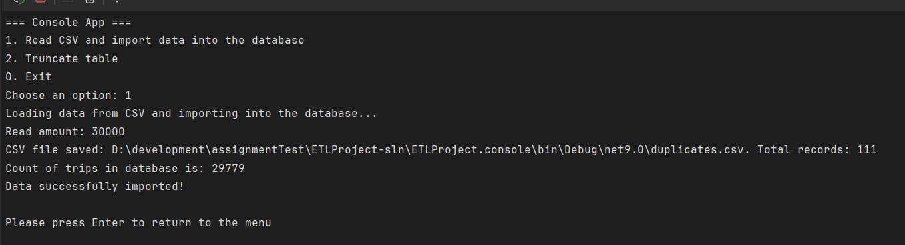

# ETL Project

This was an interesting task! I didn’t initially think the task could be anything other than a "Write Todo List on Asp.net Api" However, there was one thing I overlooked — **a null value** on 18806 line in .cvs. I didn’t account for this edge case at first, which led to some issues that took me a little time to figure out. 

🚗 Delivered

1. Try to import database was in this way: Database -> tasks -> import flat file

2. Logs from menu: 

    29770 - Unique records,  
    111 - Duplicate records  

3. Here is written all information about optimization of requests [SqlCommand.md](./SqlCommand.md)

4. Q: Describe in a few sentences what you would change if you knew it would be used for a 10GB CSV input file.  

    A: In my opinion, the best solution is to divide the file into smaller pieces using parallelization. Of course, this is only can be if the task allows for it.

